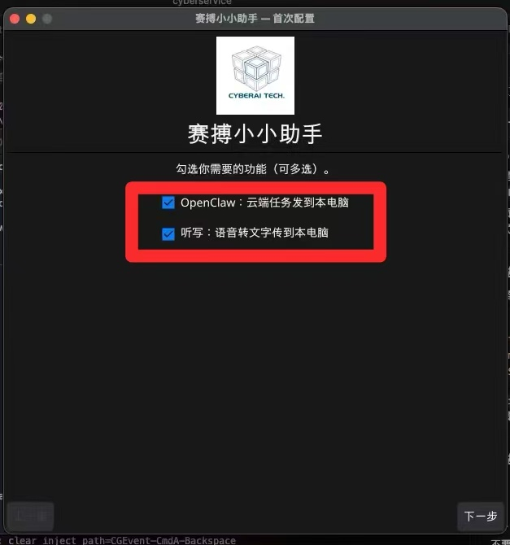
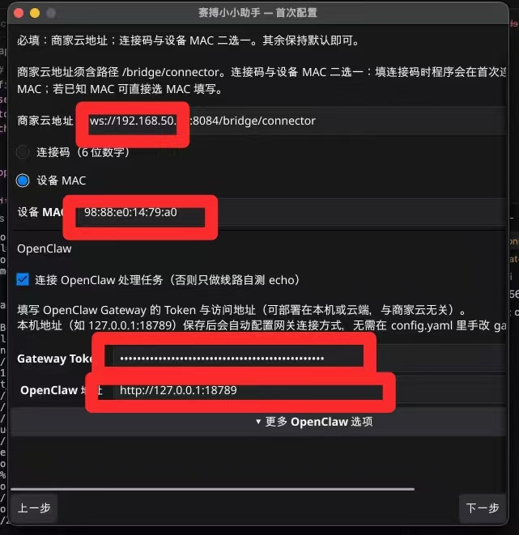
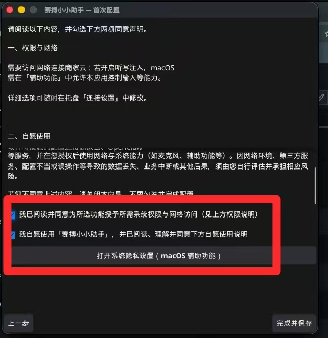
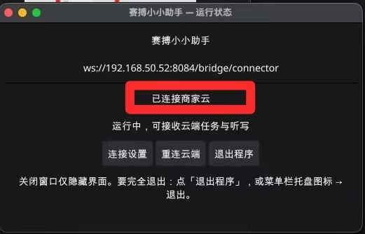
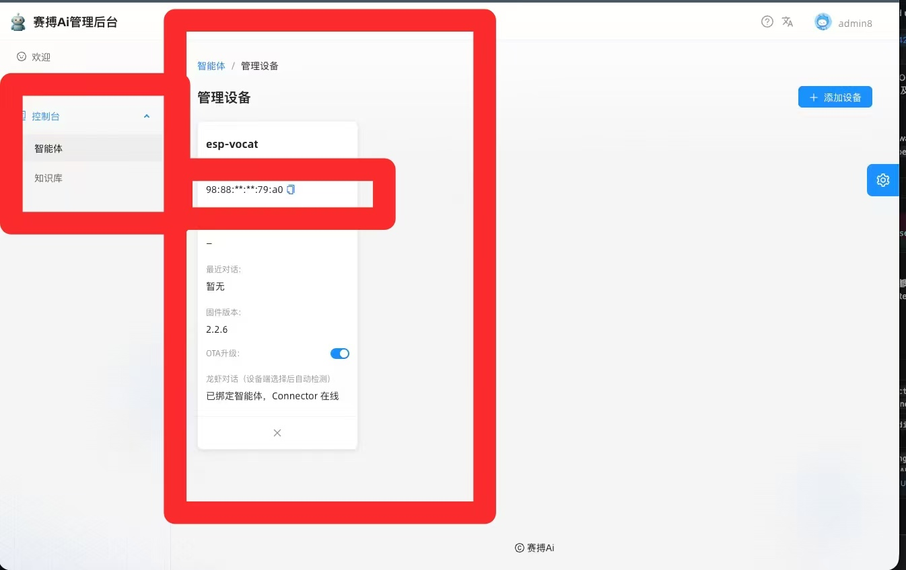

# 赛搏小小助手（SaiboAssistant）— 下载、配置与使用指南

本文说明 **赛搏小小助手** 的下载、首次向导与日常配置。

> ## 设备配对方式（v0.2.15+）
>
> | 方式 | 状态 | 说明 |
> |------|------|------|
> | **6 位连接码** | ✅ **推荐** | 喵伴 **OpenClaw 对话** 或 **听写转发** 页显示；向导选「连接码（6 位数字）」填入即可 |
> | **设备 MAC** | ✅ 仍可用 | 管理台「设备管理」中复制 MAC，选「设备 MAC」填写 |
>
> v0.2.14 及更早 Release **仅支持 MAC**；**6 位连接码** 请下载 **[v0.2.15 GitHub Release](https://github.com/nakakak/SaiboAssistant/releases/tag/v0.2.15)**（推荐）或源码构建。

---

## 首次使用全景：电脑上要准备哪些信息？

下面这张表是 **第一次在电脑上安装、配置并真正用起来** 所需的全部信息。按表逐项准备，即可同时支持 **OpenClaw 对话** 与 **听写转发**。

### 0. 开始前：环境与账号（电脑 + 云端 + 设备）

| 检查项 | 必须？ | 说明 | 如何确认 / 调整 |
|--------|--------|------|-----------------|
| 商家云已运行 | ✅ | 本机或局域网 `anime-ai-chat-server` | 浏览器能打开管理台，如 `http://192.168.50.176:8084` |
| 桥接已开启 | ✅ | 云端 `bridge_enabled: true` 且已重启服务 | 设备/OpenClaw 页能收到状态；curl 见下文「连上前自检」 |
| 设备已绑定 | ✅ | 喵伴 MAC 已在 **当前这台商家云** 注册并关联智能体 | 管理台 → **设备管理** → 能看到该 MAC；Connector 离线时可查 **6 位配对码** |
| 电脑与云、设备同网 | ✅（局域网） | 助手、Gateway、商家云互通 | 本机 `curl http://192.168.50.176:8084/` 有响应 |
| OpenClaw Gateway | 用 OpenClaw 时 ✅ | 本机 `openclaw gateway`，默认端口 **18789** | 终端运行后 `lsof -i :18789` 有监听 |
| macOS 辅助功能 | 用听写注入时 ✅ | 允许「赛搏小小助手」控制电脑 | 系统设置 → 隐私与安全性 → 辅助功能 |

### 1. 配置项总表（向导 / `config.yaml` / 连接设置）

| 配置项 | 必填？ | 含义 | 从哪里获取 | 如何填写 / 调整 |
|--------|--------|------|------------|-----------------|
| **`server_url`** | ✅ | 连商家云 Connector 的 WebSocket | 内置默认 `ws://192.168.50.176:8084/bridge/connector`；公网为 `wss://xiaozhi.cyberai.top/bridge/connector` | 向导中为灰色只读；局域网/换云：**托盘 → 连接设置 → 商家云 WebSocket → 保存并重连**。须含路径 **`/bridge/connector`**，不要手写 `?token=` |
| **`pair_code`**（6 位） | 与 MAC **二选一** | 把本机助手绑定到 **某一台** 喵伴 | 喵伴圆环 → **OpenClaw 对话** 或 **听写转发**；仅 **Connector 离线** 时屏显「配对码 XXXXXX」 | 向导第 2 步选 **连接码**，填入 6 位数字；程序 `POST /api/public/connector-code-resolve` 解析 MAC 并写回 `config.yaml` |
| **`device_mac`** | 与连接码 **二选一** | 设备唯一 ID | 管理台 **设备管理** 列表；或配对码解析后自动写入 | 格式 `30:ED:A0:2A:AF:14`；换设备时改 MAC 或重新填配对码 |
| **`channels.openclaw`** | 看用途 | 是否处理 OpenClaw 云端任务 | 首次向导勾选 | **托盘 → 通道设置**；至少保留 OpenClaw / 听写之一 |
| **`channels.telnet`** | 看用途 | 是否接收听写 `dictation.stt` | 首次向导勾选 | 同上；仅听写时可只开 Telnet |
| **`openclaw.mode`** | OpenClaw 时 | `echo` 自测 / `gateway_ws` 真连 Gateway | 向导勾选「连接 OpenClaw 处理任务」→ `gateway_ws` | **连接设置** 或 `config.yaml`；自测可留 `echo` |
| **`openclaw.gateway_token`** | `gateway_ws` 时 ✅ | 本机 OpenClaw 网关令牌 | `~/.openclaw/openclaw.json` → `gateway.auth.token` | 向导 / 连接设置；与商家云 token **无关** |
| **`openclaw.base_url`** | `gateway_ws` 时 ✅ | Gateway HTTP 基址 | 本机默认 `http://127.0.0.1:18789` | Gateway 在别的机器时填那台机器的地址 |
| **`dictation.inject`** | 听写注入时 | 是否写入 PC 输入框 | 默认 `true` | `config.yaml` 或通道相关设置；Mac 需辅助功能 |
| **`dictation.subtitle`** | 否 | 是否弹悬浮字幕窗 | 默认 `false`（仅注入） | 要悬浮窗改为 `true` |

**配对码说明：** 每台设备 **长期固定一串**（除非管理台手动重新生成）。填一次后 `config.yaml` 会保存 `device_mac`，以后重连一般 **不必再填码**。

### 2. 推荐：第一次完整配置流程（局域网商家云示例）

按顺序做一遍，即可在电脑上 **OpenClaw + 听写** 都能用：

1. **启动商家云**（本例 `192.168.50.176:8084`），确认 `bridge_enabled: true`。
2. **启动 OpenClaw Gateway**（另开终端）：
   ```bash
   openclaw gateway
   ```
3. **下载或构建 SaiboAssistant**，首次运行弹出向导。
4. **向导第 1 步**：勾选需要的功能（OpenClaw / 听写，可多选）。
5. **向导第 2 步**：
   - 商家云地址：默认已填 `ws://192.168.50.176:8084/bridge/connector`（一般不用改）。
   - 设备：选 **连接码**，在喵伴 **OpenClaw 或听写转发** 页看 **配对码** 并填入（SaiboAssistant 已运行时需先退出助手，屏上才会显示码）。
   - OpenClaw：勾选「连接 OpenClaw 处理任务」；**Gateway Token** 粘贴 `jq -r '.gateway.auth.token' ~/.openclaw/openclaw.json`；地址 `http://127.0.0.1:18789`。
6. **向导第 3 步**：同意权限；macOS 听写注入在 **辅助功能** 中允许本程序。
7. **完成** → 托盘显示 **已连接商家云**；喵伴再进 OpenClaw/听写页，配对码应 **隐藏**（Connector 在线）。
8. **听写测试**：Mac 先点好输入框 → 喵伴听写转发 → **开始传输** → 说话 → 文字应注入当前框。

### 3. 配置落盘示例（`config.yaml`）

首次向导完成后，典型有效配置类似：

```yaml
server_url: "ws://192.168.50.176:8084/bridge/connector"
device_mac: "30:ED:A0:2A:AF:14"   # 填过连接码后会自动写入
# pair_code: "537724"             # 可选保留；有 device_mac 时可省略

channels:
  openclaw: true
  telnet: true

openclaw:
  mode: "gateway_ws"
  base_url: "http://127.0.0.1:18789"
  gateway_token: "<来自 openclaw.json>"

dictation:
  enabled: true
  inject: true
  subtitle: false
```

文件位置：与 `SaiboAssistant` **同目录**；目录不可写时在系统用户配置目录下的 `SaiboAssistant/config.yaml`。

### 4. 连上后自检

| 检查 | 期望结果 |
|------|----------|
| 托盘 / 运行状态 | **已连接商家云** |
| 商家云日志 | `bridge connector` 在线、`connector_ready` |
| 喵伴 OpenClaw / 听写页 | Connector 在线时 **不显示** 配对码 |
| OpenClaw | 喵伴 OpenClaw 页 **开始对话** 能拾音并收到回复 |
| 听写 | 设备 **开始传输** 后 Mac 输入框出现识别文字 |
| curl（可选） | `curl -s "http://192.168.50.176:8084/bridge/connector?device_mac=你的MAC"` → `websocket upgrade failed` 表示桥接与设备校验通过 |

### 5. 日后修改配置

| 需求 | 操作 |
|------|------|
| 换商家云 / 改 IP | 托盘 → **连接设置** → 改 `server_url` → **保存并重连** |
| 换绑定设备 | 改 **连接码** 或 **MAC** → 保存并重连 |
| 只开听写、关 OpenClaw | **通道设置** 取消 OpenClaw |
| 重走首次向导 | `config.yaml` 设 `first_run: true` 后重启程序 |
| Gateway Token 变了 | 连接设置更新 Token → 重连 |

> v0.2.14 及更早 GitHub Release **仅支持 MAC 配对**；**6 位连接码** 请用 **[v0.2.15+ Release](https://github.com/nakakak/SaiboAssistant/releases/tag/v0.2.15)** 或源码构建。

---

## 一、版本怎么选？

| 版本 | 获取方式 | 6 位连接码 | 听写转发 | 说明 |
|------|----------|------------|----------|------|
| **v0.2.15+**（推荐） | [GitHub Release v0.2.15](https://github.com/nakakak/SaiboAssistant/releases/tag/v0.2.15) 或源码构建 | ✅ | ✅ | 当前 **Latest**；配对码长期固定；管理台可查码 |
| **v0.2.14** | [GitHub Release](https://github.com/nakakak/SaiboAssistant/releases/tag/v0.2.14) 预编译包 | ❌ 仅 MAC | ✅ | 历史版本；无连接码向导 |
| v0.2.13 及更早 | 历史 Release | ❌ | 部分 | 不建议新装 |

**局域网商家云（本仓库默认内置）：** `ws://192.168.50.176:8084/bridge/connector`  
**公网商家云：** `wss://xiaozhi.cyberai.top/bridge/connector`

---

## 二、各操作系统 Release 下载（v0.2.14 — GitHub 已发布）

### 2.1 Release 页面

打开：**https://github.com/nakakak/SaiboAssistant/releases/tag/v0.2.14**

在 **Assets** 中下载 **与你电脑对应的一个文件**（见下表「推荐下载」列）。  
**不要**点 *Source code (zip/tar.gz)* — 那是源码，不是可执行程序。

### 2.2 全平台对照表

| 操作系统 | CPU 架构 | 如何确认 | **推荐下载（单文件，直接运行）** | 完整压缩包（含示例配置） |
|----------|----------|----------|----------------------------------|--------------------------|
| **Windows** | x64（64 位） | 设置 → 系统 → 关于 → **64 位操作系统** | `SaiboAssistant-Windows-x64.exe` | `openclaw-connector_v0.2.14_windows_amd64.zip` |
| **macOS** | Apple Silicon（M1/M2/M3/M4） | 左上角  → 关于本机 → **芯片：Apple M…** | `SaiboAssistant-macOS-arm64` | `openclaw-connector_v0.2.14_darwin_arm64.tar.gz` |
| **macOS** | Intel（x64） | 关于本机 → **处理器：Intel** | `SaiboAssistant-macOS-x64` | `openclaw-connector_v0.2.14_darwin_amd64.tar.gz` |
| **Linux** | x86_64（amd64） | `uname -m` → `x86_64` | `SaiboAssistant-Linux-x64` | `openclaw-connector_v0.2.14_linux_amd64.tar.gz` |
| **Linux** | arm64（aarch64） | `uname -m` → `aarch64` | `SaiboAssistant-Linux-arm64` | `openclaw-connector_v0.2.14_linux_arm64.tar.gz` |

> **不支持：** Windows 32 位、macOS PowerPC、Linux 32 位 armhf 等 — 无对应 Release，请用 **x64/arm64 电脑** 或 **从源码交叉编译**。

### 2.3 固定直链（v0.2.14）

将 `v0.2.14` 换成将来版本号即可用于新版本（如 `v0.2.15`）。

```text
https://github.com/nakakak/SaiboAssistant/releases/download/v0.2.14/SaiboAssistant-Windows-x64.exe
https://github.com/nakakak/SaiboAssistant/releases/download/v0.2.14/SaiboAssistant-macOS-arm64
https://github.com/nakakak/SaiboAssistant/releases/download/v0.2.14/SaiboAssistant-macOS-x64
https://github.com/nakakak/SaiboAssistant/releases/download/v0.2.14/SaiboAssistant-Linux-x64
https://github.com/nakakak/SaiboAssistant/releases/download/v0.2.14/SaiboAssistant-Linux-arm64
```

压缩包直链示例：

```text
https://github.com/nakakak/SaiboAssistant/releases/download/v0.2.14/openclaw-connector_v0.2.14_windows_amd64.zip
https://github.com/nakakak/SaiboAssistant/releases/download/v0.2.14/openclaw-connector_v0.2.14_darwin_arm64.tar.gz
https://github.com/nakakak/SaiboAssistant/releases/download/v0.2.14/openclaw-connector_v0.2.14_darwin_amd64.tar.gz
https://github.com/nakakak/SaiboAssistant/releases/download/v0.2.14/openclaw-connector_v0.2.14_linux_amd64.tar.gz
https://github.com/nakakak/SaiboAssistant/releases/download/v0.2.14/openclaw-connector_v0.2.14_linux_arm64.tar.gz
```

校验文件：`checksums-sha256.txt`（与 Assets 同页下载）。

### 2.4 各系统命令行下载示例

**macOS Apple Silicon：**

```bash
mkdir -p ~/SaiboAssistant && cd ~/SaiboAssistant
curl -fL -o SaiboAssistant-macOS-arm64 \
  https://github.com/nakakak/SaiboAssistant/releases/download/v0.2.14/SaiboAssistant-macOS-arm64
chmod +x SaiboAssistant-macOS-arm64
xattr -cr SaiboAssistant-macOS-arm64   # 若 Gatekeeper 拦截
./SaiboAssistant-macOS-arm64
```

**macOS Intel：**

```bash
curl -fL -o SaiboAssistant-macOS-x64 \
  https://github.com/nakakak/SaiboAssistant/releases/download/v0.2.14/SaiboAssistant-macOS-x64
chmod +x SaiboAssistant-macOS-x64 && xattr -cr SaiboAssistant-macOS-x64
./SaiboAssistant-macOS-x64
```

**Windows（PowerShell）：**

```powershell
New-Item -ItemType Directory -Force -Path "$env:USERPROFILE\SaiboAssistant" | Out-Null
Set-Location "$env:USERPROFILE\SaiboAssistant"
Invoke-WebRequest -Uri "https://github.com/nakakak/SaiboAssistant/releases/download/v0.2.14/SaiboAssistant-Windows-x64.exe" `
  -OutFile "SaiboAssistant-Windows-x64.exe"
.\SaiboAssistant-Windows-x64.exe
```

**Linux x86_64：**

```bash
curl -fL -o SaiboAssistant-Linux-x64 \
  https://github.com/nakakak/SaiboAssistant/releases/download/v0.2.14/SaiboAssistant-Linux-x64
chmod +x SaiboAssistant-Linux-x64
./SaiboAssistant-Linux-x64
```

**Linux arm64（树莓派 4/5、ARM 服务器等）：**

```bash
curl -fL -o SaiboAssistant-Linux-arm64 \
  https://github.com/nakakak/SaiboAssistant/releases/download/v0.2.14/SaiboAssistant-Linux-arm64
chmod +x SaiboAssistant-Linux-arm64
./SaiboAssistant-Linux-arm64
```

### 2.5 校验 SHA256（可选）

```bash
# 下载 checksums 后与本地文件比对（macOS 用 shasum -a 256）
curl -fL -O https://github.com/nakakak/SaiboAssistant/releases/download/v0.2.14/checksums-sha256.txt
sha256sum -c checksums-sha256.txt   # Linux
# 或手动：
shasum -a 256 SaiboAssistant-macOS-arm64
```

v0.2.14 参考校验值（`dist-v0.2.14/checksums-saibo-sha256.txt`）：

```text
SaiboAssistant-macOS-arm64   d09634de100dba97d93211c15610e9083ea45f8f043491c8ec3b19d53b0d85cb
SaiboAssistant-macOS-x64     84c131bb1443806e21403017687a53c832d0efcebbe34356bc032b004d9b95c9
SaiboAssistant-Linux-x64     9002cb8a9011f753dbe1de345ceff75a492d6b744188b307dce669af64ba61bd
SaiboAssistant-Linux-arm64   70122036073231c7729854779c47f209b8c9f3850e045918e11722733c903eb2
SaiboAssistant-Windows-x64.exe 9413beb00ad6b3fc6d90f64baeeff1d2dae50d77bc38f1ce7ad47dbe44a7260f
```

---

## 三、v0.2.15+ 下载（连接码配对 — 推荐新用户）

**GitHub 已发布 v0.2.15**，可直接下载预编译包（含 **6 位连接码** 向导）：

### 3.1 Release 页面与全平台直链

打开：**https://github.com/nakakak/SaiboAssistant/releases/tag/v0.2.15**

| 操作系统 | CPU | **推荐下载** | 完整压缩包 |
|----------|-----|--------------|------------|
| Windows | x64 | `SaiboAssistant-Windows-x64.exe` | `openclaw-connector_v0.2.15_windows_amd64.zip` |
| macOS | Apple Silicon | `SaiboAssistant-macOS-arm64` | `openclaw-connector_v0.2.15_darwin_arm64.tar.gz` |
| macOS | Intel | `SaiboAssistant-macOS-x64` | `openclaw-connector_v0.2.15_darwin_amd64.tar.gz` |
| Linux | x86_64 | `SaiboAssistant-Linux-x64` | `openclaw-connector_v0.2.15_linux_amd64.tar.gz` |
| Linux | arm64 | `SaiboAssistant-Linux-arm64` | `openclaw-connector_v0.2.15_linux_arm64.tar.gz` |

固定直链（将版本号换成 `v0.2.15`）：

```text
https://github.com/nakakak/SaiboAssistant/releases/download/v0.2.15/SaiboAssistant-Windows-x64.exe
https://github.com/nakakak/SaiboAssistant/releases/download/v0.2.15/SaiboAssistant-macOS-arm64
https://github.com/nakakak/SaiboAssistant/releases/download/v0.2.15/SaiboAssistant-macOS-x64
https://github.com/nakakak/SaiboAssistant/releases/download/v0.2.15/SaiboAssistant-Linux-x64
https://github.com/nakakak/SaiboAssistant/releases/download/v0.2.15/SaiboAssistant-Linux-arm64
https://github.com/nakakak/SaiboAssistant/releases/download/v0.2.15/checksums-sha256.txt
```

校验：

```bash
curl -fL -O https://github.com/nakakak/SaiboAssistant/releases/download/v0.2.15/checksums-sha256.txt
shasum -a 256 -c checksums-sha256.txt
```

### 3.2 从源码构建（可选）

**环境：** Go **1.22+**、`CGO_ENABLED=1`、C 编译器（macOS Xcode CLT、Linux `gcc`+Fyne 依赖、Windows MinGW）。

```bash
git clone https://github.com/nakakak/SaiboAssistant.git
cd SaiboAssistant
go build -trimpath -ldflags="-s -w" -o SaiboAssistant ./cmd/openclaw-connector
./SaiboAssistant
```

Windows 输出名为 `SaiboAssistant.exe`。命令行一次性配对：

```bash
./SaiboAssistant --pair 123456 --headless
```

### 3.3 本地打全平台 Release 包（维护者）

```bash
cd SaiboAssistant
./scripts/package-release.sh v0.2.15 --all
ls dist/
# SaiboAssistant-macOS-arm64、SaiboAssistant-Windows-x64.exe、… 及 tar.gz/zip
```

---

## 四、各系统安装与首次启动

### 4.1 通用

1. 将 **单个可执行文件** 放到固定目录（如 `~/SaiboAssistant/`、`%USERPROFILE%\SaiboAssistant`）。
2. **首次运行** 在同目录生成 `config.yaml`，并弹出 **「赛搏小小助手 — 首次配置」** 向导。
3. 配置目录不可写时，写入：
   - **macOS：** `~/Library/Application Support/SaiboAssistant/config.yaml`
   - **Windows：** `%APPDATA%\SaiboAssistant\config.yaml`
   - **Linux：** `~/.config/SaiboAssistant/config.yaml`

### 4.2 Windows

| 步骤 | 操作 |
|------|------|
| 安装 | 无需安装器；下载 `.exe` 即可 |
| 启动 | 双击 `SaiboAssistant-Windows-x64.exe` |
| 防火墙 | 首次可能提示网络访问，请 **允许**（需连商家云与本机 Gateway） |
| 听写注入 | 一般无需额外设置；安全软件拦截剪贴板/模拟按键时需放行 |
| 无界面运行 | `SaiboAssistant-Windows-x64.exe -headless`（须已配置好 `config.yaml`） |

### 4.3 macOS

| 步骤 | 操作 |
|------|------|
| 权限 | `chmod +x SaiboAssistant-macOS-*` |
| Gatekeeper | 若提示「无法验证开发者」：系统设置 → 隐私与安全性 → **仍要打开**；或 `xattr -cr ./SaiboAssistant-macOS-arm64` |
| 托盘 | 程序在 **菜单栏** 常驻；窗口关闭 ≠ 退出 |
| 听写注入 | **系统设置 → 隐私与安全性 → 辅助功能** → 允许「赛搏小小助手」 |
| 架构 | M 系列用 **arm64**；Intel Mac 用 **x64**，不可混用 |

### 4.4 Linux

| 步骤 | 操作 |
|------|------|
| 依赖 | GUI 需 X11/Wayland 与 OpenGL（Fyne）；无图形环境用 `-headless` |
| 听写 X11 | 安装 `xdotool`、`xclip` 或 `xsel` |
| 听写 Wayland | 可尝试 `wtype`（环境差异大，建议 X11 会话测试） |
| 启动 | `chmod +x SaiboAssistant-Linux-* && ./SaiboAssistant-Linux-x64` |

### 4.5 使用压缩包（可选）

解压 `openclaw-connector_v0.2.14_*` 后目录内含：

- 可执行文件（`openclaw-connector` 或 `.exe`）
- `config.example.yaml` — 复制为 `config.yaml` 后修改
- `README.md`、`iconai.jpg`

---

## 五、从 v0.2.14 升级到 v0.2.15+

1. **退出** 托盘中的赛搏小小助手。
2. 用 **v0.2.15 二进制** 替换旧文件（或重新 `go build`）。
3. 任选其一：
   - `config.yaml` 设 `first_run: true`，重新走向导并选 **连接码**；或
   - 保留已有 `device_mac`，在连接设置中确认 `server_url` 正确后 **保存并重连**。
4. **说明：** v0.2.14 用户可继续用 **设备 MAC**，不强制换连接码。

---

## 六、首次配置向导（界面说明）

> **v0.2.15+ 配对（推荐）**  
> 1. 喵伴进入 **OpenClaw 对话** 或 **听写转发** 页，记下屏幕 **6 位配对码**（Connector 离线时显示）。  
> 2. 向导第 2 步默认选 **「连接码（6 位数字）」**，填入即可；程序自动向商家云解析 MAC。  
> 3. 局域网商家云默认 **`ws://192.168.50.176:8084/bridge/connector`**；公网可在连接设置中改为 `wss://xiaozhi.cyberai.top/bridge/connector`。

> **v0.2.14 Release 用户**  
> 若使用旧版二进制，仍须选 **「设备 MAC」** 并手动填写；连接码选项在旧版中无效。

### 第 1 步：欢迎与功能选择

- **OpenClaw：云端任务发到本电脑** — 设备经商家云把任务派到本机 OpenClaw。
- **听写：语音转文字传到本电脑** — 听写内容经云端转发到本机（可注入输入框）。

**至少勾选一项**，点 **「下一步」**。



### 第 2 步：商家云与设备配对（必填）

#### （1）商家云地址

**v0.2.15+** 已内置公网地址，向导中一般为灰色只读。局域网测试时在 **连接设置** 中改为例如 `ws://192.168.50.176:8084/bridge/connector`。

须包含路径 **`/bridge/connector`**，**不要**手写 `?token=` 等 query。

**格式：** `ws://` 或 `wss://` + 域名或 IP + 端口（若需要）+ `/bridge/connector`

##### 环境对照表（与赛搏 AI 管理后台一致）

| 环境 | 商家云登录地址 | **SaiboAssistant 填写的 server_url** |
|------|----------------|--------------------------------------|
| **公网云（推荐线上）** | https://xiaozhi.cyberai.top | **`wss://xiaozhi.cyberai.top/bridge/connector`** |
| 局域网测试（本仓库默认） | http://192.168.50.176:8084 | `ws://192.168.50.176:8084/bridge/connector` |
| 局域网测试（其它 IP） | http://192.168.50.52:8084 | `ws://192.168.50.52:8084/bridge/connector` |
| 本机开发 | http://127.0.0.1:8084 | `ws://127.0.0.1:8084/bridge/connector` |

说明：上表「商家云登录地址」为 **Web 入口**（用户/管理员均从此登录）；登录后在菜单进入 **设备管理** 等页面即可，**不必**在地址后加 `/admin`。

说明：

- 管理台 **Web 配置** 里的「WebSocket 地址」（如 `wss://xiaozhi.cyberai.top/ws`）是给 **设备语音传输** 用的，**不是** 赛搏小小助手的地址。
- 助手必须填带 **`/bridge/connector`** 的地址（上表第三列）。
- 公网云若走 HTTPS 反代，一般用 **`wss://`** 且**不写**管理台里的内部端口（8085）；若直连端口再试 `wss://xiaozhi.cyberai.top:8085/bridge/connector`。

##### 切换商家云时（局域网 → 公网云）

1. 托盘 → **连接设置**
2. **商家云 WebSocket** 改为：`wss://xiaozhi.cyberai.top/bridge/connector`
3. 确认 **设备 MAC** 已在**目标云**管理台注册（换云后须在该云重新添加/绑定设备）
4. 点 **保存并重连**
5. 公网云服务器数据库里须有 **`bridge_enabled: true`** 并已重启服务（与局域网改库同理）

##### 连上前自检（公网云）

```bash
# 不要用 /health 判断能否连助手；用下面这条：
curl -s "https://xiaozhi.cyberai.top/bridge/connector?device_mac=你的MAC"
```

- `bridge disabled` → 云端未开桥接，需在云端库 `server_configs` 设 `bridge_enabled: true` 并重启服务
- `websocket upgrade failed` → 桥接已开、设备校验通过（curl 正常，可开助手）
- `device not found` → 该 MAC 未在**此云**注册

其它示例：

```text
wss://xiaozhi.cyberai.top/bridge/connector
ws://192.168.50.52:8084/bridge/connector
ws://127.0.0.1:8084/bridge/connector
```


#### （2）设备配对（二选一）

在向导或 **连接设置** 的设备标识区域：

| 方式 | 操作 |
|------|------|
| **连接码（6 位数字）** ✅ 推荐 | 选此项，填入喵伴 OpenClaw 页屏幕上的 6 位数字；保存后自动解析 MAC |
| **设备 MAC** | 选此项，填写管理台 MAC，如 `30:ed:a0:2a:af:14` |

MAC 可在商家云 **设备管理** 列表中查看（见第五节）。

#### （3）OpenClaw（仅勾选 OpenClaw 时显示）

- **连接 OpenClaw 处理任务**：勾选后连真实 Gateway；不勾选则为 **echo 自测**。
- **Gateway Token**：见下文第六节。
- **OpenClaw 地址**：本机常用 `http://127.0.0.1:18789`。

**v0.2.14 说明**：OpenClaw 填本机地址（如 `127.0.0.1:18789`）时，保存后会**自动配置**网关连接方式，**无需**在 `config.yaml` 里手改 `gateway_same_host`。听写默认仅 **inject**（不显示悬浮字幕）。

**从 v0.2.12 升级**：建议删除旧目录下的 `config.yaml` 后重新运行，或在其中设 `first_run: true` 再走一遍向导，并**重新填写**商家云地址。



点 **「下一步」**。

### 第 3 步：权限与同意

勾选 **阅读说明** 与 **资源使用** 等同意项；macOS 听写注入需在 **辅助功能** 中允许本程序。点 **「完成配置」**。



---

## 七、配置完成后：主界面与日常使用

### 7.1 运行状态窗口与托盘常驻

- 首次点 **「完成配置」** 后，主窗口可能自动收起；程序在 **菜单栏（macOS）/ 系统托盘** 继续运行，**并未退出**。
- 从托盘点 **「运行状态」** 可再次打开窗口；点 **「退出程序」** 才会真正结束。
- 窗口内显示商家云地址与连接状态（**已连接商家云** 表示成功）。
- **连接设置** / **重连云端** / **退出程序**。
- 系统托盘：运行状态、连接设置、通道设置、重连、退出。

### 7.2 修改配置

托盘或运行状态窗 → **连接设置** → **保存并重连**。  
`config.yaml` 在程序同目录（或系统配置目录）。



<!-- 可选截图：07-settings-server-url.png、08-tray-menu.png -->

---

## 八、如何获取设备 MAC 地址

### 方式 A：商家云管理台（推荐）

1. 打开商家云 Web 入口并登录（公网云示例：**https://xiaozhi.cyberai.top**），进入 **设备管理**。
2. 打开 **设备管理**，在列表中找到目标设备。
3. 复制该设备的 **MAC 地址**（设备 ID），填入赛搏小小助手向导或连接设置的 **「设备 MAC」** 栏。



### 方式 B：机身标贴 / 烧录日志 / 开发配置

从设备包装盒、ESP 烧录日志或 `config.yaml` 等查看，格式须为 `AA:BB:CC:DD:EE:FF`。

### 关于 6 位连接码

喵伴 **OpenClaw 对话** 或 **听写转发** 页在电脑 Connector **未连接** 时会显示 **6 位配对码**。也可在管理台 **设备管理** 中查看（Connector 离线且已绑定智能体时）。在赛搏小小助手（**v0.2.15+**）中选「连接码」填入后，程序调用 `POST /api/public/connector-code-resolve` 得到 `device_mac` 并写回 `config.yaml`。

| 问题 | 说明 |
|------|------|
| 码在哪里？ | 喵伴圆环 → **OpenClaw 对话** 或 **听写转发**（仅 **Connector 离线** 时显示「配对码 XXXXXX」） |
| 已开助手却看不到码？ | Connector 在线时屏上会隐藏码；先 **退出赛搏助手** 或断开连接，再进设备页查看 |
| 码会变吗？ | **默认长期不变**（每台设备固定一串）；仅管理台 **手动重新生成** 后会换 |
| 管理台能查吗？ | 当前 Web **设备管理** 只显示桥接状态；查码以 **设备屏幕** 为准（或 API `openclaw-capability` 扩展后可查） |
| 换电脑 | 在新 Mac 用 **当前屏幕配对码** 再配；已保存 MAC 的旧电脑可继续用 |
| 旧版 v0.2.14 | 不支持连接码，请用 MAC 或源码构建 v0.2.15+ |

---

## 九、如何获取 OpenClaw Gateway Token

> 与商家云 **设备 MAC** **不是同一项**；仅在使用真实 OpenClaw（`gateway_ws`）时需要。

**macOS / Linux：**

```bash
jq -r '.gateway.auth.token' ~/.openclaw/openclaw.json
```

**Windows（PowerShell）：**

```powershell
(Get-Content "$env:USERPROFILE\.openclaw\openclaw.json" | ConvertFrom-Json).gateway.auth.token
```

启动 Gateway（示例，以本机 OpenClaw 为准）：

```bash
openclaw gateway
```

再填 **OpenClaw 地址**（如 `http://127.0.0.1:18789`）与 **Gateway Token**。

---

## 十、命令行启动（可选）

```bash
./SaiboAssistant-macOS-arm64
./SaiboAssistant-macOS-arm64 -config /绝对路径/config.yaml
./SaiboAssistant-macOS-arm64 -config ./config.yaml -headless   # 无界面，须已有 config
```

Windows：`.\SaiboAssistant-Windows-x64.exe`

---

## 十一、配置完成后如何使用

1. **OpenClaw 任务**：助手已连云、OpenClaw 通道已开、Gateway 已运行；设备绑定正确后即可派发任务。
2. **听写**：开启听写通道；设备上「开始传输」；注入模式需先点好 PC 输入框。
3. **保持在线**：程序需常驻；退出后设备侧显示 Connector 离线。

---

## 十二、配置文件与安全

| 项目 | 说明 |
|------|------|
| 配置位置 | 与 `SaiboAssistant-*` **同目录** 的 `config.yaml` |
| 敏感信息 | 含 Gateway Token 等，勿外传 |
| 单文件 Release | **不含** 源码；配置由首次运行 **自动生成** |
| v0.2.15+ | 支持 `pair_code`；解析后写入 `device_mac` |

---

## 十三、常见问题

| 现象 | 处理 |
|------|------|
| Mac 无法打开 | 系统设置 → 仍要打开；或 `xattr -cr ./SaiboAssistant-macOS-arm64` |
| 换商家云后界面仍显示旧地址 | v0.2.14 已修复；旧版请用「连接设置 → 保存并重连」，或查看 `config.yaml` 中 `server_url` |
| 配置完成后窗口消失 | **正常**：程序在托盘常驻，从托盘打开「运行状态」 |
| 下错架构（如 Intel Mac 下了 arm64） | 程序无法运行；按第二节表格重新下载对应文件 |
| 仍用 v0.2.14 却要连接码 | 请升级 **[v0.2.15 Release](https://github.com/nakakak/SaiboAssistant/releases/tag/v0.2.15)** 或改填 **设备 MAC** |
| 无法连接商家云 | 检查 `server_url`、端口、`bridge_enabled`；须为完整 `ws://.../bridge/connector` |
| 连接码无效 | 确认 6 位数字与 **当前设备屏幕** 一致；SaiboAssistant 在线时屏上可能不显示码，先退出助手再查看 |
| 用了 v0.2.14 填连接码 | 旧版不支持；请升级 **v0.2.15+** 或改填 **设备 MAC** |
| `device not found` | MAC 与当前商家云不一致，或设备未在该云注册 |
| OpenClaw 失败 | Gateway 是否运行、Token 是否与 `openclaw.json` 一致 |
| `missing scope: operator.write` | 请升级到 **v0.2.14+**；本机 OpenClaw 会自动处理；改配置后点 **重连云端** 或完全退出再开 |
| macOS 听写不注入 | 辅助功能中允许本程序 |

---

## 十四、相关链接

| 链接 | 说明 |
|------|------|
| [GitHub Releases](https://github.com/nakakak/SaiboAssistant/releases) | 全部版本与 Assets |
| [v0.2.15（当前 Latest）](https://github.com/nakakak/SaiboAssistant/releases/tag/v0.2.15) | 预编译包，含连接码与管理台可查码 |
| [v0.2.14](https://github.com/nakakak/SaiboAssistant/releases/tag/v0.2.14) | 历史版本，仅 MAC 配对 |
| [BRIDGE_CLI.md](./BRIDGE_CLI.md) | 终端 `miaoban-bridge` CLI |

如有商家云地址、管理台账号等问题，请联系服务提供方或运维。
